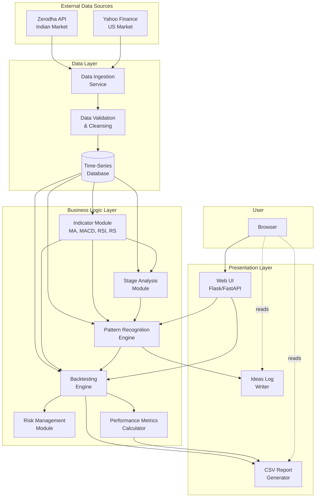

# Architecture
Principles
- **Modularity:** Separate concerns into distinct, testable components
- **Extensibility:** Design for future expansion (real-time, more patterns, more markets)
- **Performance:** Optimize for batch processing of large datasets
- **Maintainability:** Clean code with abundant comments, clear separation of data/business logic/presentation, 
- **Documentation:** Maintain clear documentation for each component

### High-Level Architecture Style
**Layered Architecture** with the following layers:
1. **Data Layer:** Data acquisition, storage, and access
2. **Business Logic Layer:** Pattern recognition, backtesting, calculations
3. **Presentation Layer:** Web UI and reporting

---

## Engineering Standards Compliance

This design adheres to the [Engineering Standards] established for this project.

**Key Commitments:**
- **Code Quality:** SOLID principles, clean architecture, comprehensive documentation
- **Security:** OWASP ASVS Level 2 compliance, secure coding practices (CERT)
- **Testing:** ≥80% branch coverage, testing pyramid approach, automated regression testing
- **Reliability:** Resilience patterns (timeouts, retries, circuit breakers)
- **Observability:** Structured logging (JSON), metrics, distributed tracing (future)
- **CI/CD:** Automated testing, linting, security scanning on every commit
- **Documentation:** Code docstrings, ADRs, runbooks, architecture diagrams (C4 model)

All code, architecture decisions, and processes will conform to these standards unless explicitly documented otherwise via Architecture Decision Record (ADR).

---

## Architecture

### System Architecture Diagram



### Component Interaction Flow

**Data Ingestion Flow:**
```
Zerodha/Yahoo Finance → Data Ingestion → Validation → Database → Ready for Analysis
```

**Pattern Scanning Flow:**
```
User Request → Web UI → Pattern Recognition Engine → Indicator Module → Database
                                ↓
                         Stage Analysis Module
                                ↓
                         Pattern Matches → Ideas Log
```

**Backtesting Flow:**
```
User Config → Backtesting Engine → Load Historical Data → Simulate Trades
                    ↓                                            ↓
            Risk Management Module                    Track Positions
                    ↓                                            ↓
            Performance Metrics ← Calculate Returns/Risk ← Final P&L
                    ↓
            CSV Report Generator
```

---
