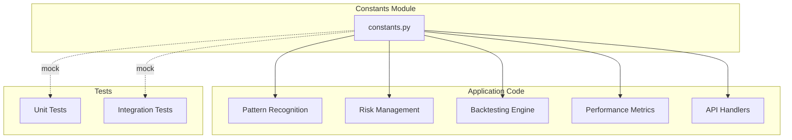

# Component Design
### 1. Data Layer

#### 1.1 Data Ingestion Service

**Responsibilities:**
- Fetch historical and daily data from Zerodha and Yahoo Finance
- Handle API rate limits and retries
- Schedule overnight batch updates
- Validate and cleanse incoming data

**Key Classes:**
```python
from abc import ABC, abstractmethod
from datetime import date
import pandas as pd
from typing import Optional

class DataProvider(ABC):
    """
    Abstract base class for market data providers.
    
    Purpose:
        Defines uniform interface for all data providers (Zerodha, Yahoo Finance, etc.)
        Ensures consistent data acquisition regardless of source.
        Enables Strategy Pattern - swap data sources without changing client code.
        
    Design Pattern:
        Strategy Pattern - allows runtime selection of data source
        
    Implementation Requirements:
        - fetch_historical() must return standardized DataFrame format
        - Data must be validated before returning
        - Errors must use custom exception hierarchy
        
    Usage:
        provider = ZerodhaDataProvider(api_key, access_token)
        data = provider.fetch_historical('RELIANCE', start_date, end_date)
    """
    
    @abstractmethod
    def fetch_historical(
        self,
        symbol: str,
        start_date: date,
        end_date: date
    ) -> pd.DataFrame:
        """
        Fetch historical OHLCV data for a security.
        
        Purpose:
            Retrieve price and volume history for backtesting and pattern analysis.
            Data must be validated and normalized to standard format.
        
        Args:
            symbol: Stock ticker (e.g., "RELIANCE" for NSE, "AAPL" for NASDAQ)
            start_date: First date of data to retrieve (inclusive)
            end_date: Last date of data to retrieve (inclusive)
        
        Returns:
            DataFrame with columns: date, open, high, low, close, volume
            Index: DatetimeIndex in ascending chronological order
            All prices in local currency (INR for India, USD for US)
            Volume in number of shares traded
        
        Raises:
            ValueError: If start_date > end_date or symbol format invalid
            APIError: If data provider API fails
            DataValidationError: If retrieved data fails quality checks
            
        Example:
            >>> provider = ZerodhaDataProvider(api_key, token)
            >>> df = provider.fetch_historical('RELIANCE', date(2020,1,1), date(2020,12,31))
            >>> df.head()
                        date    open    high     low   close    volume
            0  2020-01-01  1450.0  1465.0  1448.0  1460.0  5000000
        """
        pass

from backend.core.constants import API_TIMEOUT_SECONDS
from kiteconnect import KiteConnect

class ZerodhaDataProvider(DataProvider):
    """
    Zerodha Kite Connect API client for Indian market data (NSE/BSE).
    
    Purpose:
        Fetch historical and (future) real-time data from Zerodha.
        Handles authentication, rate limiting, and data normalization.
        
    Authentication:
        Requires API key and daily access token.
        Access token expires daily and must be refreshed.
        
    Rate Limits:
        - Historical data: 3 requests/second
        - Retry with exponential backoff if rate limited
        
    Usage:
        provider = ZerodhaDataProvider(
            api_key="your_api_key",
            access_token="daily_token"
        )
        data = provider.fetch_historical("NSE:RELIANCE", start, end)
    """
    
    def __init__(self, api_key: str, access_token: str):
        """
        Initialize Zerodha data provider with credentials.
        
        Purpose:
            Set up authenticated connection to Kite Connect API.
        
        Args:
            api_key: Kite Connect API key from Zerodha developer console
            access_token: User-specific access token (regenerated daily)
        
        Raises:
            AuthenticationError: If credentials are invalid
        """
        self.kite = KiteConnect(api_key=api_key)
        self.kite.set_access_token(access_token)
        
    def fetch_historical(
        self,
        symbol: str,
        start_date: date,
        end_date: date
    ) -> pd.DataFrame:
        """
        Fetch historical data from Zerodha Kite Connect.
        
        Purpose:
            Retrieve OHLCV data for Indian stocks (NSE/BSE).
            Normalizes Kite Connect response to standard format.
        
        Implementation Details:
            - Kite expects instrument token, not symbol (we look it up)
            - Returns data in IST timezone
            - Handles corporate actions (splits, bonuses) automatically
        
        Args:
            symbol: Stock symbol with exchange prefix (e.g., "NSE:RELIANCE")
            start_date: Start date for data retrieval
            end_date: End date for data retrieval
            
        Returns:
            DataFrame with standardized columns and DatetimeIndex
            
        Raises:
            DataFetchError: If API call fails
            DataValidationError: If response data is invalid
        """
        try:
            # Kite uses instrument tokens, not symbols
            instrument_token = self._get_instrument_token(symbol)
            
            # Fetch from Kite API
            records = self.kite.historical_data(
                instrument_token=instrument_token,
                from_date=start_date,
                to_date=end_date,
                interval="day",
                timeout=API_TIMEOUT_SECONDS  # From constants.py
            )
            
            # Convert to DataFrame
            df = pd.DataFrame(records)
            
            # Normalize column names to standard format
            df = df.rename(columns={
                'date': 'date',
                # Kite uses OHLC, we standardize to lowercase
            })
            
            # Set datetime index
            df['date'] = pd.to_datetime(df['date'])
            df = df.set_index('date').sort_index()
            
            # Validate data quality
            self._validate_data(df, symbol)
            
            return df
            
        except Exception as e:
            # Log and wrap in custom exception
            logger.error(f"Zerodha fetch failed for {symbol}", exc_info=True)
            raise DataFetchError(f"Failed to fetch {symbol} from Zerodha") from e

class YahooFinanceProvider(DataProvider):
    """Yahoo Finance data provider implementation using yfinance."""
    
    def fetch_historical(self, symbol: str, start_date: date, end_date: date) -> pd.DataFrame:
        """Fetch historical data from Yahoo Finance."""
        # Implementation details
        pass

class DataIngestionOrchestrator:
    """Orchestrates data ingestion from multiple providers."""
    
    def ingest_universe(self, provider: DataProvider, symbol_list: List[str]) -> None:
        """
        Ingest historical data for all symbols in the universe.
        
        Args:
            provider: Data provider instance
            symbol_list: List of symbols to ingest
        """
        pass
    
    def schedule_daily_update(self) -> None:
        """Schedule and execute daily data updates."""
        pass
```

**Data Validation Rules:**
- Check for missing dates (non-trading days acceptable)
- Validate OHLCV integrity (High ≥ Low, Close within High-Low range)
- Volume must be non-negative
- Price must be non-negative
- Handle stock splits and dividends (adjusted prices)

#### 1.4 Constants Module

**Overview:**

**File:** `backend/core/constants.py`

**Purpose:**  
Centralized repository for all application constants, thresholds, and configuration values. Provides single source of truth for tunable parameters with comprehensive documentation.

**Design Benefits:**
- ✅ No magic numbers scattered in code
- ✅ Self-documenting (each constant has purpose comment)
- ✅ Easy to modify for different strategies or markets
- ✅ Type-safe with Python type hints
- ✅ Testable (mock constants for edge case testing)

---

##### Categories

The constants module organizes values into logical categories:

###### 1. Pattern Recognition Thresholds
Constants defining when patterns are detected:
- `TREND_TEMPLATE_RS_THRESHOLD = 70` - Minimum RS for Trend Template
- `TREND_TEMPLATE_PRICE_ABOVE_52W_LOW_PCT = 1.30` - Price must be >30% above 52-week low
- `VCP_MIN_CONTRACTIONS = 2` - Minimum pullbacks for VCP
- `VCP_TOLERANCE_PCT = 0.20` - Allowable deviation in contraction depth
- `CUP_HANDLE_MIN_WEEKS = 6` - Minimum cup formation duration

###### 2. Risk Management Parameters
Constants controlling position sizing and risk:
- `INITIAL_CAPITAL = 100000` - Starting portfolio value
- `INITIAL_STOP_LOSS_PCT = 0.10` - 10% initial stop-loss
- `MAX_POSITION_SIZE_PCT = 0.10` - Max 10% of portfolio per position
- `MAX_PORTFOLIO_RISK_PCT = 0.02` - Max 2% portfolio risk per trade
- `MAX_POSITIONS = 10` - Maximum concurrent positions

###### 3. Performance Targets
Constants defining acceptable performance:
- `TARGET_FULL_SCAN_MINUTES = 30` - Universe scan time target
- `TARGET_BACKTEST_MINUTES = 30` - Backtest execution target
- `DATA_INGESTION_SUCCESS_RATE_TARGET = 0.99` - 99% success rate
- `DATABASE_QUERY_P95_LATENCY_MS = 500` - Database response time
- `API_RESPONSE_P95_LATENCY_MS = 2000` - API response time

###### 4. Technical Indicator Periods
Constants for indicator calculation:
- `MA_PERIOD_50 = 50` - 50-day moving average
- `MA_PERIOD_150 = 150` - 150-day moving average
- `MA_PERIOD_200 = 200` - 200-day moving average
- `MANSFIELD_RS_SMOOTH_PERIOD = 52` - 52-week RS smoothing
- `RSI_PERIOD = 14` - RSI calculation period

###### 5. Data Processing
Constants for data operations:
- `TRADING_DAYS_PER_YEAR = 252` - For annualization
- `RISK_FREE_RATE = 0.04` - 4% annual risk-free rate
- `LOOKBACK_YEARS = 20` - Historical data depth
- `MIN_TRADING_VOLUME = 100000` - Minimum daily volume filter

###### 6. Testing & Coverage
Constants for test configuration:
- `MIN_BRANCH_COVERAGE_PCT = 80` - Minimum test coverage
- `MAX_UNIT_TEST_DURATION_SECONDS = 300` - Test suite timeout

###### 7. API & Retry Configuration
Constants for resilience:
- `API_TIMEOUT_SECONDS = 30` - API call timeout
- `API_RETRY_MAX_ATTEMPTS = 3` - Maximum retry attempts
- `API_RETRY_BACKOFF_SECONDS = 1` - Initial backoff duration
- `DATA_INGESTION_RETRY_DELAY_SECONDS = 300` - Delay before retry

---

##### Usage Examples

###### Good Practice (Import Constants):

```python
from backend.core.constants import (
    TREND_TEMPLATE_RS_THRESHOLD,
    INITIAL_STOP_LOSS_PCT,
    MAX_POSITION_SIZE_PCT,
    TRADING_DAYS_PER_YEAR
)

def meets_entry_criteria(symbol_metrics: Dict) -> bool:
    """
    Check if symbol meets all entry criteria.
    
    Purpose:
        Constants make the logic self-documenting.
        Intent is clear from constant names.
    """
    return (
        symbol_metrics['mansfield_rs'] > TREND_TEMPLATE_RS_THRESHOLD and
        symbol_metrics['position_size'] <= MAX_POSITION_SIZE_PCT
    )

def calculate_annualized_return(daily_returns: pd.Series) -> float:
    """Calculate annualized return from daily returns."""
    return daily_returns.mean() * TRADING_DAYS_PER_YEAR
```

###### Bad Practice (Avoid - Magic Numbers):

```python
# ❌ DON'T DO THIS - Magic numbers with no context
def meets_entry_criteria(symbol_metrics):
    return (
        symbol_metrics['rs'] > 70 and  # Why 70? What does it represent?
        symbol_metrics['size'] <= 0.10  # Why 0.10? Portfolio %? Position %?
    )

def calculate_return(returns):
    return returns.mean() * 252  # Why 252? Days? Weeks?
```

---

##### Design Pattern

**Pattern:** Configuration Object / Constants Module

**Benefits:**
1. **Single Source of Truth:** Change once, affects entire codebase
2. **Self-Documenting:** Constant names convey meaning
3. **Type Safety:** Python type hints prevent errors
4. **Testability:** Easy to mock for testing edge cases
5. **Strategy Variations:** Create different constant files for different strategies

**Example - Testing with Different Constants:**
```python
# In tests/test_pattern_detection.py
from unittest.mock import patch

def test_vcp_detection_strict_criteria():
    """Test VCP with stricter tolerance."""
    with patch('backend.core.constants.VCP_TOLERANCE_PCT', 0.10):
        # Now VCP requires tighter contractions
        result = detect_v cp(test_data)
        assert result == expected_strict_result

def test_entry_with_higher_rs_threshold():
    """Test entries with higher RS requirement."""
    with patch('backend.core.constants.TREND_TEMPLATE_RS_THRESHOLD', 80):
        # Only consider very strong RS stocks
        entries = get_entry_signals(universe)
        assert all(e['rs'] > 80 for e in entries)
```

---

##### Future Enhancements

**Phase 2: Environment-Based Overrides**
```python
# Allow environment variables to override constants
import os

INITIAL_STOP_LOSS_PCT = float(
    os.getenv('STOP_LOSS_PCT', '0.10')
)
```

**Phase 3: Strategy Profiles**
```python
# Different constant sets for different strategies
from backend.core.constants.aggressive import *
# vs
from backend.core.constants.conservative import *
```

---

##### Architecture Diagram



### 2. Business Logic Layer

#### 2.1 Indicator Module

**Responsibilities:**
- Calculate technical indicators from price data
- Support both real-time and batch calculation
- Cache results in derived_metrics table

**Key Classes:**
```python
class IndicatorCalculator:
    def calculate_moving_averages(df: DataFrame) -> DataFrame
    def calculate_rsi(df: DataFrame, period=14) -> Series
    def calculate_macd(df: DataFrame) -> DataFrame
    def calculate_mansfield_rs(stock_df: DataFrame, index_df: DataFrame) -> Series
    def calculate_52week_high_low(df: DataFrame) -> tuple
    def calculate_volume_average(df: DataFrame, period=50) -> Series
```

**Indicator Calculation Pipeline:**
```
Raw OHLCV Data → Calculate Indicators → Validate Results → Store in derived_metrics
```

#### 2.2 Pattern Recognition Engine

**Responsibilities:**
- Identify chart patterns from price data and indicators
- Apply Mark Minervini's Trend Template criteria
- Detect VCP, Cup & Handle, Double Bottom, High-Tight Flag
- Assign confidence scores

**Key Classes:**
```python
class PatternRecognizer(ABC):
    def detect(df: DataFrame, metrics: DataFrame) -> List[PatternMatch]
    def calculate_confidence(match: PatternMatch) -> float

class TrendTemplateRecognizer(PatternRecognizer):
    def check_criteria(df, metrics) -> bool
    # Implements 7 trend template criteria

class VCPRecognizer(PatternRecognizer):
    def find_contractions(df) -> List[Contraction]
    def validate_vcp_pattern(contractions) -> PatternMatch

class CupAndHandleRecognizer(PatternRecognizer):
    def detect_cup(df) -> CupPattern
    def detect_handle(df, cup) -> HandlePattern

class DoubleBottomRecognizer(PatternRecognizer):
    def find_bottoms(df) -> List[Bottom]
    def validate_double_bottom(bottoms) -> PatternMatch

class HighTightFlagRecognizer(PatternRecognizer):
    def detect_power_play(df) -> PatternMatch

class PatternScanOrchestrator:
    def scan_all_symbols(date: Date) -> List[PatternDetection]
    def scan_symbol(symbol, date) -> List[PatternDetection]
```

**Trend Template Logic:**
```python
def check_trend_template(symbol_id, date):
    # Load price data and metrics
    # Check each criterion:
    # 1. price > ma_150 and price > ma_200
    # 2. ma_150 > ma_200
    # 3. ma_200 trending up (compare with 30 days ago)
    # 4. ma_50 > ma_150 and ma_50 > ma_200
    # 5. price > 1.3 * week_52_low
    # 6. price >= 0.75 * week_52_high
    # 7. mansfield_rs > 70
    # Return boolean and details
```

**VCP Detection Algorithm:**
```python
def detect_vcp(df, tolerance=0.20):
    # 1. Identify pullbacks (peaks to troughs)
    # 2. Count contractions (2-4 required)
    # 3. Verify each pullback is shallower than previous
    # 4. Check volume contraction during pullbacks
    # 5. Apply tolerance (20%) for flexibility
    # 6. Return VCP match with confidence score
```

#### 2.3 Stage Analysis Module

**Responsibilities:**
- Classify stocks into Weinstein's 4 stages
- Use moving averages and price action

**Stage Classification Logic:**
```python
def classify_weinstein_stage(df, metrics):
    # Stage 1 (Base): Sideways, MA flattening
    # Stage 2 (Advance): Price > rising MA, higher highs
    # Stage 3 (Top): Sideways, MA flattening after rise
    # Stage 4 (Decline): Price < falling MA, lower lows
    # Return stage number (1-4)
```

#### 2.4 Backtesting Engine

**Responsibilities:**
- Simulate historical trades based on strategy rules
- Track positions, calculate P&L
- Apply risk management rules
- Generate trade log and performance metrics

**Key Classes:**

```python
from backend.core.constants import (
    INITIAL_CAPITAL,
    MAX_POSITIONS,
    MAX_POSITION_SIZE_PCT,
    INITIAL_STOP_LOSS_PCT
)
from datetime import date, timedelta
import pandas as pd
from typing import Dict, List

class BacktestEngine:
    """
    Systematic backtesting engine with proper position management.
    
    Purpose:
        Simulate trading strategy over historical data.
        Proper order: manage existing positions before seeking new ones.
        
    Design Pattern:
        Event-driven with daily iteration loop.
        Positions-first approach prevents common backtesting errors.
    """
    
    def __init__(
        self,
        initial_capital: float = INITIAL_CAPITAL,
        max_positions: int = MAX_POSITIONS,
        max_position_size_pct: float = MAX_POSITION_SIZE_PCT
    ):
        """
        Initialize backtesting engine.
        
        Args:
            initial_capital: Starting portfolio value (from constants.py)
            max_positions: Max concurrent positions (from constants.py)
            max_position_size_pct: Max % of portfolio per position
        """
        self.initial_capital = initial_capital
        self.cash = initial_capital
        self.max_positions = max_positions
        self.max_position_size_pct = max_position_size_pct
        
        self.positions: Dict[str, Position] = {}  # Active positions
        self.trades: List[Trade] = []  # Completed trades history
        self.equity_curve: List[float] = []  # Daily portfolio values
        
    def run_backtest(
        self,
        symbols: List[str],
        start_date: date,
        end_date: date,
        pattern_detector,
        risk_manager
    ) -> Dict:
        """
        Execute backtest over date range.
        
        Purpose:
            Simulate strategy day-by-day with proper position management.
            The order of operations is CRITICAL for accurate results.
        
        Algorithm (POSITIONS-FIRST APPROACH):
            a. Update existing positions with current prices
            b. Check exit conditions for all positions
            c. Update portfolio metrics (P&L, cash, drawdown)
            d. Scan all symbols for pattern matches
            e. Generate entry signals from patterns
            f. Check risk management constraints
            g. Execute entries (only if risk checks pass)
            h. Calculate final performance metrics
        
        Args:
            symbols: List of tickers to backtest
            start_date: Backtest start date
            end_date: Backtest end date
            pattern_detector: Pattern recognition instance
            risk_manager: Risk management instance
            
        Returns:
            Dict with performance metrics and trade history
        """
        current_date = start_date
        
        # Main backtest loop - iterate day by day
        while current_date <= end_date:
            # Get market data for all symbols on this date
            market_data = self._fetch_market_data(symbols, current_date)
            
            # ===================================================================
            # STEP A: Update existing positions with current prices
            # ===================================================================
            # WHY FIRST: We need current position values for exit checks
            #            and portfolio metrics calculations
            for symbol, position in self.positions.items():
                if symbol in market_data:
                    current_price = market_data[symbol]['close']
                    position.update_price(current_price, current_date)
            
            # ===================================================================
            # STEP B: Check exit conditions for ALL positions
            # ===================================================================
            # WHY BEFORE ENTRIES: Free up cash and position slots
            #                      before looking for new trades
            exit_signals = []
            for symbol, position in list(self.positions.items()):
                # Check stop-loss
                if position.current_price <= position.stop_loss:
                    exit_signals.append({
                        'symbol': symbol,
                        'reason': 'STOP_LOSS',
                        'price': position.current_price
                    })
                
                # Check take-profit target
                elif position.current_price >= position.take_profit:
                    exit_signals.append({
                        'symbol': symbol,
                        'reason': 'TAKE_PROFIT',
                        'price': position.current_price
                    })
                
                # Check pattern breakdown (exit signal)
                elif pattern_detector.check_exit_signal(symbol, market_data):
                    exit_signals.append({
                        'symbol': symbol,
                        'reason': 'SIGNAL',
                        'price': position.current_price
                    })
            
            # Execute all exits
            for exit_signal in exit_signals:
                self._execute_exit(
                    symbol=exit_signal['symbol'],
                    exit_price=exit_signal['price'],
                    exit_date=current_date,
                    reason=exit_signal['reason']
                )
            
            # ===================================================================
            # STEP C: Update portfolio metrics
            # ===================================================================
            # WHY NOW: After exits but before entries
            #          Gives us accurate cash available and position count
            total_position_value = sum(
                pos.current_value for pos in self.positions.values()
            )
            portfolio_value = self.cash + total_position_value
            
            # Track for equity curve and drawdown calculation
            self.equity_curve.append(portfolio_value)
            
            # Calculate current drawdown
            peak_value = max(self.equity_curve)
            current_drawdown = (peak_value - portfolio_value) / peak_value
            
            # ===================================================================
            # STEP D: Scan all symbols for pattern matches
            # ===================================================================
            # WHY AFTER POSITION MANAGEMENT: We know how many slots available
            pattern_matches = pattern_detector.scan_all_symbols(
                symbols=symbols,
                date=current_date,
                market_data=market_data
            )
            
            # ===================================================================
            # STEP E: Generate entry signals from patterns
            # ===================================================================
            entry_candidates = []
            for match in pattern_matches:
                # Only consider if pattern confidence above threshold
                if match['confidence'] >= 70:  # Could be constant
                    entry_candidates.append({
                        'symbol': match['symbol'],
                        'pattern': match['pattern_type'],
                        'entry_price': market_data[match['symbol']]['close'],
                        'confidence': match['confidence']
                    })
            
            # Sort by confidence (best opportunities first)
            entry_candidates.sort(key=lambda x: x['confidence'], reverse=True)
            
            # ===================================================================
            # STEP F: Check risk management constraints
            # ===================================================================
            # WHY CRITICAL: Prevent over-leverage, excessive risk
            approved_entries = []
            
            for candidate in entry_candidates:
                # Check #1: Do we have available position slots?
                if len(self.positions) >= self.max_positions:
                    break  # Portfolio full, no more entries today
                
                # Check #2: Calculate position size
                position_size = portfolio_value * self.max_position_size_pct
                shares = int(position_size / candidate['entry_price'])
                cost = shares * candidate['entry_price']
                
                # Check #3: Do we have enough cash?
                if cost > self.cash:
                    continue  # Skip this candidate, not enough cash
                
                # Check #4: Correlation check (avoid too many similar positions)
                if risk_manager.check_correlation_risk(
                    candidate['symbol'],
                    list(self.positions.keys())
                ):
                    continue  # Too correlated with existing positions
                
                # Check #5: Drawdown limit
                if current_drawdown > 0.20:  # Could be MAX_DRAWDOWN_LIMIT constant
                    break  # Stop trading if in significant drawdown
                
                # All checks passed - approve entry
                approved_entries.append({
                    'symbol': candidate['symbol'],
                    'shares': shares,
                    'entry_price': candidate['entry_price'],
                    'pattern': candidate['pattern']
                })
            
            # ===================================================================
            # STEP G: Execute approved entries
            # ===================================================================
            # WHY LAST: Only after all risk checks passed
            for entry in approved_entries:
                self._execute_entry(
                    symbol=entry['symbol'],
                    shares=entry['shares'],
                    entry_price=entry['entry_price'],
                    entry_date=current_date,
                    stop_loss_pct=INITIAL_STOP_LOSS_PCT  # From constants.py
                )
            
            # Move to next trading day
            current_date += timedelta(days=1)
        
        # ===================================================================
        # STEP H: Calculate final performance metrics
        # ===================================================================
        # After backtest completes, calculate all metrics
        final_metrics = self._calculate_performance_metrics()
        
        return {
            'metrics': final_metrics,
            'trades': self.trades,
            'equity_curve': pd.Series(self.equity_curve),
            'final_value': self.equity_curve[-1] if self.equity_curve else self.initial_capital
        }
    
    def _execute_entry(
        self,
        symbol: str,
        shares: int,
        entry_price: float,
        entry_date: date,
        stop_loss_pct: float
    ):
        """
        Execute position entry.
        
        Purpose:
            Open new position, update cash, track in portfolio.
        """
        cost = shares * entry_price
        stop_loss_price = entry_price * (1 - stop_loss_pct)
        
        # Create position
        position = Position(
            symbol=symbol,
            shares=shares,
            entry_price=entry_price,
            entry_date=entry_date,
            stop_loss=stop_loss_price,
            take_profit=entry_price * 1.20  # 20% target, could be constant
        )
        
        # Update portfolio
        self.positions[symbol] = position
        self.cash -= cost
        
        logger.info(
            f"ENTRY: {symbol} {shares} shares @ ${entry_price:.2f}",
            extra={'symbol': symbol, 'entry_date': entry_date}
        )
    
    def _execute_exit(
        self,
        symbol: str,
        exit_price: float,
        exit_date: date,
        reason: str
    ):
        """
        Execute position exit.
        
        Purpose:
            Close position, realize P&L, free up cash and position slot.
        """
        position = self.positions.pop(symbol)  # Remove from active positions
        
        # Calculate P&L
        proceeds = position.shares * exit_price
        profit_loss = proceeds - (position.shares * position.entry_price)
        profit_loss_pct = profit_loss / (position.shares * position.entry_price)
        
        # Update cash
        self.cash += proceeds
        
        # Record trade for history
        trade = Trade(
            symbol=symbol,
            entry_date=position.entry_date,
            entry_price=position.entry_price,
            exit_date=exit_date,
            exit_price=exit_price,
            shares=position.shares,
            profit_loss=profit_loss,
            profit_loss_pct=profit_loss_pct,
            exit_reason=reason
        )
        self.trades.append(trade)
        
        logger.info(
            f"EXIT: {symbol} {position.shares} shares @ ${exit_price:.2f} "
            f"({reason}) P&L: ${profit_loss:.2f} ({profit_loss_pct*100:.1f}%)"
        )
```


#### 2.5 Risk Management Module

**Responsibilities:**
- Apply stop-loss and take-profit rules
- Enforce portfolio-level risk limits
- Position sizing

**Key Functions:**
```python
class RiskManager:
    def calculate_stop_loss(entry_price, strategy) -> float
    def calculate_take_profit(entry_price, strategy) -> float
    def update_trailing_stop(position: Position, current_price)
    def check_portfolio_drawdown(portfolio) -> bool
    def check_position_limits(portfolio, new_trade) -> bool
    def calculate_position_size(signal, portfolio) -> int
```

**Hybrid Stop-Loss Logic:**
```python
def update_stop_loss(position, current_price):
    # Initial: Fixed 10% stop
    if position.unrealized_pnl_pct < X_PERCENT:
        stop = position.entry_price * 0.90
    else:
        # Switch to trailing stop after X% gain
        atr = calculate_atr(position.symbol)
        trailing_stop = current_price - (2 * atr)  # 2x ATR trailing
        stop = max(position.stop_loss, trailing_stop)
    
    position.stop_loss = stop
```

#### 2.6 Performance Metrics Calculator

**Responsibilities:**
- Calculate all required performance metrics
- Generate backtest reports

**Key Metrics:**
```python
class PerformanceCalculator:
    def calculate_total_return(portfolio) -> float
    def calculate_annualized_return(portfolio, days) -> float
    def calculate_cagr(portfolio, years) -> float
    def calculate_sharpe_ratio(returns, risk_free_rate=0) -> float
    def calculate_sortino_ratio(returns, risk_free_rate=0) -> float
    def calculate_max_drawdown(equity_curve) -> float
    def calculate_win_rate(trades) -> float
    def calculate_profit_factor(trades) -> float
```

### 3. Presentation Layer

#### 3.1 Web UI (FastAPI)

**Responsibilities:**
- Provide user interface for triggering scans and backtests
- Display results and reports
- Allow configuration of strategies

**Key Endpoints:**
```python
# Data management
POST /api/data/ingest          # Trigger data ingestion
GET  /api/data/status           # Check data status

# Pattern scanning
POST /api/scan/patterns         # Trigger pattern scan
GET  /api/scan/results/{date}   # Get scan results

# Backtesting
POST /api/backtest/run          # Run backtest
GET  /api/backtest/results/{id} # Get backtest results
GET  /api/backtest/list         # List all backtests

# Reports
GET  /api/reports/ideas          # Download ideas.csv
GET  /api/reports/backtest/{id}  # Download backtest CSV
```

**Web Pages:**
- Dashboard (overview, recent scans, backtest results)
- Data Management (trigger updates, view status)
- Pattern Scanner (configure and run scans)
- Backtesting (configure strategy, run backtest, view results)
- Reports (download ideas.csv, backtest CSVs)

#### 3.2 Ideas CSV Writer

**Format:** CSV file with structured data for easy analysis in Excel or pandas

**Header Row:**
```csv
Timestamp,Symbol,Pattern,Price,Volume,RS,Confidence,Trade,Entry,StopLoss,TakeProfit,PositionSize,Rationale
```

**Example Data Row:**
```csv
2025-11-26 09:30:00,RELIANCE,VCP+TrendTemplate,2450.50,5200000,85,82,BUY,2455.00,2209.50,2945.00,10%,"Strong VCP with 3 contractions, volume declining on pullbacks. Meets all Trend Template criteria. Stage 2 advance."
```

**Field Descriptions:**
- **Timestamp:** Detection date and time (ISO format)
- **Symbol:** Stock ticker
- **Pattern:** Pattern type(s) detected (comma-separated if multiple)
- **Price:** Current close price
- **Volume:** Current volume
- **RS:** Mansfield Relative Strength score
- **Confidence:** Pattern confidence score (0-100)
- **Trade:** BUY or SELL recommendation
- **Entry:** Recommended entry price
- **StopLoss:** Stop-loss price
- **TakeProfit:** Take-profit target price
- **PositionSize:** Recommended position size (% of portfolio)
- **Rationale:** Text explanation (quoted to handle commas)

#### 3.3 CSV Report Generator

**Backtest Results CSV Structure:**
```csv
Backtest Name, Start Date, End Date, Total Return, Annualized Return, CAGR, Sharpe, Sortino, Max Drawdown, Win Rate, Profit Factor, Total Trades
```

**Trades CSV Structure:**
```csv
Symbol, Entry Date, Entry Price, Exit Date, Exit Price, Position, Quantity, P&L, P&L %, Exit Reason
```

---
