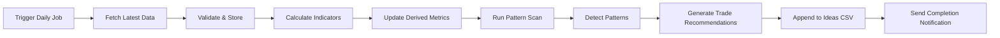
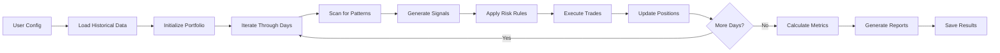

# Processing Pipeline
### Daily Batch Processing Pipeline

```mermaid
graph LR
    A[Trigger Daily Job] --> B[Fetch Latest Data]
    B --> C[Validate & Store]
    C --> D[Calculate Indicators]
    D --> E[Update Derived Metrics]
    E --> F[Run Pattern Scan]
    F --> G[Detect Patterns]
    G --> H[Generate Trade Recommendations]
    H --> I[Append to Ideas CSV]
    I --> J[Send Completion Notification]
```

### Historical Backtest Pipeline

```mermaid
graph LR
    A[User Config] --> B[Load Historical Data]
    B --> C[Initialize Portfolio]
    C --> D[Iterate Through Days]
    D --> E[Scan for Patterns]
    E --> F[Generate Signals]
    F --> G[Apply Risk Rules]
    G --> H[Execute Trades]
    H --> I[Update Positions]
    I --> J{More Days?}
    J -->|Yes| D
    J -->|No| K[Calculate Metrics]
    K --> L[Generate Reports]
    L --> M[Save Results]
```

---
